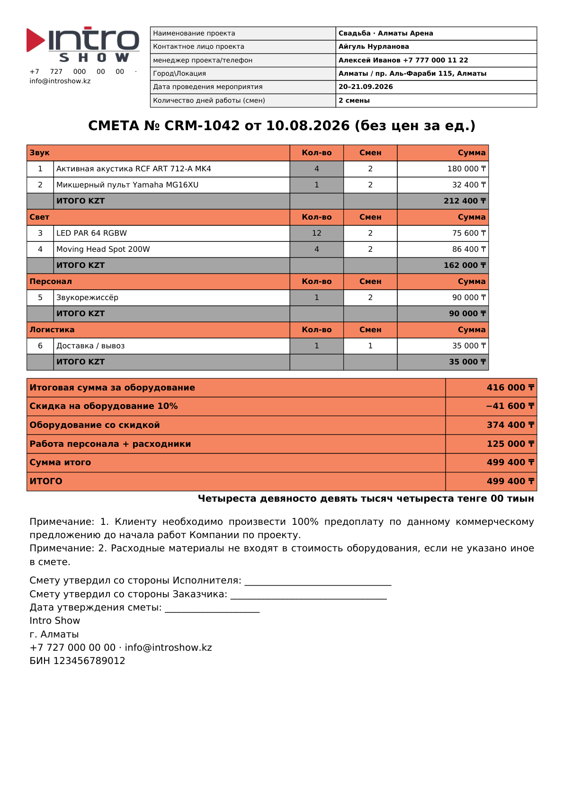
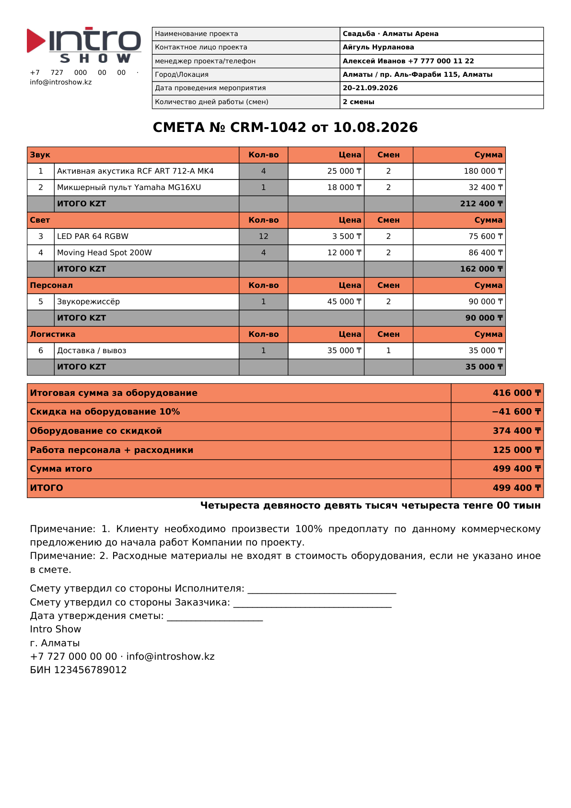
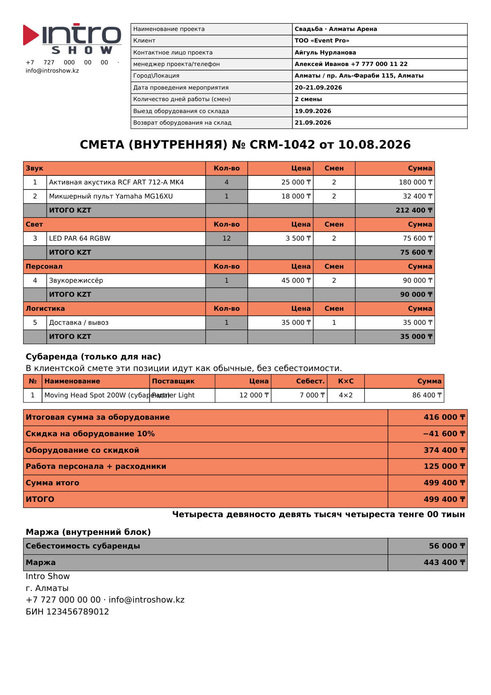
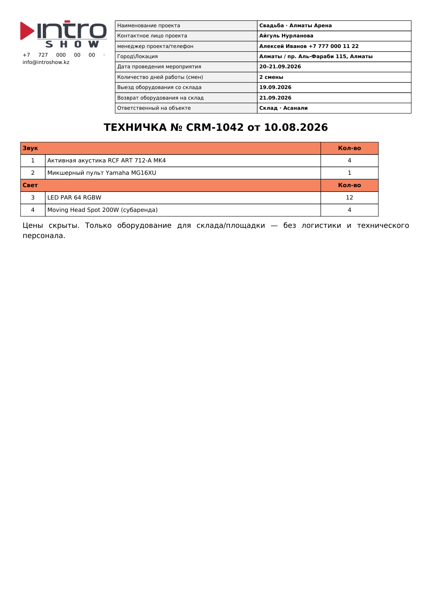
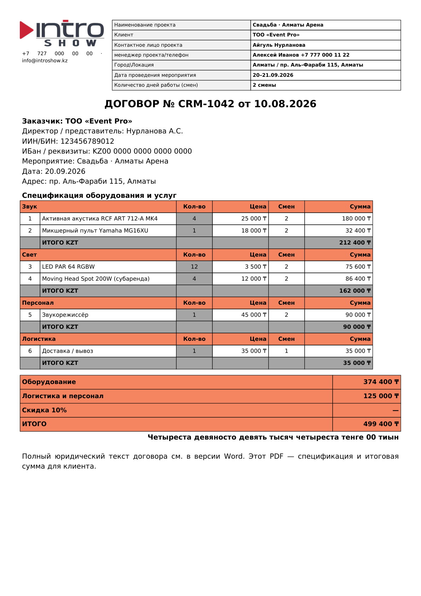

# Intro Show CRM — описание системы

**Продуктовый handbook** для презентации заказчику и онбординга команды.  
**Демо:** [https://demo-introshow.vercel.app](https://demo-introshow.vercel.app)  
**Версия production:** **v2** (= ветка `main`) · откат: `v1-stable` / tag `v1.0.0`  
**Дата сборки handbook:** 10.08.2026

Связанные материалы: `VERSIONS.md`, `static/roadmap.json`, `docs/plan-vstrecha-2026-08-05.md`, `docs/deploy-server.md`, `docs/multi-city.md`.

---

## 1. Что это

**Intro Show CRM** — отраслевая CRM для компании проката и продажи сценического оборудования (звук, свет, сцена). Система закрывает полный операционный контур:

- входящие лиды (сайт, WhatsApp, Telegram, Instagram, карты);
- квалификация (аренда / продажа / спам);
- сделки и воронки;
- сметы (внутренняя / клиентская с ценами / без цен) + техничка + договор;
- команда проекта, задачи, «Сегодня»;
- субаренда (резерв → выдача → возврат);
- деньги: авансы, расходы, ФОТ, маржа, зарплатная ведомость;
- отгрузка (собрали → … → закрыли);
- документы и клиентский пакет PDF.

| | |
|---|---|
| **Для кого** | менеджеры продаж, менеджеры проекта, техники/склад, администратор |
| **Стек** | FastAPI + Jinja2/PWA, SQLAlchemy; демо — SQLite на Vercel; бой — VPS + Postgres |
| **Production URL** | https://demo-introshow.vercel.app |

### v1 vs v2

| | **v1** (`v1-stable` / `v1.0.0`) | **v2** (`main`, сейчас в проде) |
|---|---|---|
| Фокус | рабочий контур смет / CRM / задач / ведомости | UX-оверхол + security + операционка |
| Карточка сделки | классическая | **хаб сделки** (смета, маржа, команда, отгрузка, чат) |
| Смета | несколько точек редактирования | **единая смета** `/quotes/` |
| Экран дня | нет | **«Сегодня»** |
| Деньги | авансы / расходы / ведомость | + **денежная картина / маржа** на сделке |
| Субаренда | позиции в смете | + статусы **резерв / выдача / возврат** |
| Безопасность | базовые сессии | audit, session TTL 7д, rate limit, logout-all |
| Воронки | лиды / продажи | **Аренда + Продажа**, квалификация лида |

Откат на v1: см. `VERSIONS.md` (Promote деплоя `v1-stable` / tag `v1.0.0`).

---

## 2. Как войти и роли

### Вход

1. Открыть https://demo-introshow.vercel.app/login  
2. Логин / пароль сотрудника (на чистой БД после деплоя: `admin` / `admin` — **сменить сразу**).  
3. Сессия: cookie HttpOnly + SameSite=Lax + Secure(HTTPS), TTL **7 суток**.  
4. Выход: кнопка «Выйти» в сайдбаре / профиле. Админ может сбросить все сессии пользователя (`session_version`).

### Роли

| Роль | Кто | Что может |
|---|---|---|
| **admin** | владелец / IT | все разделы, сотрудники `/users`, города, audit, воронки, настройки |
| **manager** | менеджер продаж / проекта | CRM, сметы, клиенты, задачи, корзина; переключатель городов |
| **user** (сотрудник) | техник, склад, поле | только выданные **разделы** + флаги прав |

Дополнительно в карточке сотрудника:

| Флаг | Смысл |
|---|---|
| `hide_prices` | скрыть суммы/цены в CRM и сметах (типично для техника / склада) |
| `hide_margin` | скрыть маржу проекта |
| `hide_payroll` | скрыть зарплатную ведомость |
| `hide_subrental_cost` | скрыть себестоимость субаренды |
| `crm_own_only` | в CRM только свои сделки |
| `role_sales` / `role_project` | метка менеджера продаж / проекта |

Права **по разделам** настраиваются в `/users` (Дашборд, Сегодня, Inbox, CRM, Сметы, Склад, Задачи и т.д.).

### Города

Лёгкий multi-city (одна БД, общий каталог):

- сиды: **Алматы** (активен), Астана / Шымкент (можно включить);
- admin / manager переключают город в шапке → фильтр CRM / «Сегодня» / аналитики;
- сотрудник с домашним `city_id` видит только свой город;
- в сайдбаре: `CRM · {город}`.

Подробнее: `docs/multi-city.md`.

---

## 3. Карта модулей

| Раздел меню | URL | Что делает | Как пользоваться (коротко) |
|---|---|---|---|
| **Дашборд** | `/` | сводка: сделки, выручка, активность | утренний обзор компании |
| **Сегодня** | `/today` | назначения/техничка на день, мои задачи, unread чаты, блок «Субаренда сегодня» | рабочий экран полевого дня |
| **Inbox** | `/inbox` | единый ящик WhatsApp / Telegram / Instagram | отвечать клиентам; из чата можно завести контакт/лид |
| **Внутренние** | `/chats` | чаты команды по сделкам / общим темам | @mention → уведомление в колокольчик |
| **CRM** | `/crm` | канбан лидов и сделок (Аренда / Продажа), хаб сделки | тянуть карточки по стадиям; открыть хаб → смета, команда, деньги, отгрузка |
| **Клиенты** | `/companies` | компании и контакты, реквизиты | завести контрагента до договора |
| **Сметы и договоры** | `/quotes/` | единый редактор сметы сделки | править позиции **только здесь**; из CRM — preview + «Открыть смету» |
| **Документы** | `/documents` | реестр сгенерированных DOCX/PDF | скачать повторно смету / техничку / договор |
| **Календарь** | `/calendar` | события / даты проектов | контроль загрузки по дням |
| **Склад** | `/equipment` | каталог own / subrental, остатки, цены | свой склад + позиции субаренды; конфликты дат |
| **Задачи** | `/tasks` | канбан задач (Битрикс-UX), дедлайны | ставить задачи с привязкой к сделке |
| **Аналитика** | `/analytics` | метрики + рабочее время смен | контроль конверсии и ФОТ времени |
| **AI Чат-бот** | `/assistant` | Gemini-бот, база знаний, график | код готов; нужен `GEMINI_API_KEY` + контент |
| **Настройки** | `/settings` | компания, шапка сметы, мессенджеры, 1С-ключ, города, audit | admin / с правом `settings` |
| **Корзина** | `/trash` | soft-delete сделок/сущностей | восстановление; **не защищает** от wipe БД на Vercel |
| **Сотрудники** | `/users` | пользователи, роли, права, флаги | только **admin** |

**Шапка везде:** поиск сделок/клиентов/задач · колокольчик уведомлений · переключатель города · профиль + старт/стоп рабочего дня (гео).

---

## 4. Сквозной процесс

```text
Сайт / мессенджер / карты
        ↓
      Лид (воронка Лиды)
        ↓
 Квалификация: аренда | продажа | спам
        ↓                    ↘ spam → отказ, без сделки
 Сделка: воронка Аренда или Продажа
        ↓
 Смета (/quotes) → клиентский пакет (смета ± цены + договор)
        ↓
 Команда на сделке → техничка + задача + напоминание
        ↓
 Субаренда: reserved → issued → returned
        ↓
 Задачи / «Сегодня» / внутренний чат
        ↓
 Деньги: авансы, расходы, фиксы менеджеров, ведомость, маржа
        ↓
 Отгрузка: собрали → уехали → на площадке → вернули → закрыли
        ↓
 Документы в реестре /uploads + /documents
```

### Шаги подробно

1. **Вход лида** — форма `/lead` или `POST /api/leads`, либо сообщение в Inbox (WA/TG/IG). Источник пишется на карточку; маршрутизация стадий настраивается в CRM.
2. **Квалификация** — поле аренда / продажа / спам **обязательно** перед успехом. Спам → отказ, сделка не создаётся.
3. **Сделка** — успешная стадия лида создаёт deal в воронке **Аренда** или **Продажа**. В карточке: sales_manager + project_manager, город, смены, даты.
4. **Смета** — позиции оборудования / персонала / логистики / субаренды. Скидка только на оборудование. Итоги и маржа в хабе.
5. **Клиенту** — два режима: **с ценами по позициям** / **без цен (только итог)**. Клиентский пакет — ссылки на смету + договор PDF одним действием.
6. **Команда** — назначить людей → генерируется техничка, задача, напоминание. Техничка **без** логистики/персонала и **без цен**.
7. **Субаренда** — на позициях `warehouse_type=subrental`: резерв → выдача → возврат; блок на сделке и на `/today`.
8. **Задачи / Сегодня** — операционка дня; непрочитанные чаты и назначения.
9. **Деньги** — авансы и расходы на сделке; фиксы sales/project; генерация зарплатной ведомости из блока «Персонал»; картина маржи: выручка − субаренда − ФОТ − расходы − фиксы.
10. **Отгрузка** — `ops_status`: собрали / уехали / на площадке / вернули / закрыли.
11. **Документы** — Word/PDF кладутся в реестр; повторная выгрузка из хаба сделки или `/documents`.

---

## 5. Документы в системе

| Тип | Формат | Где скачать | Что внутри |
|---|---|---|---|
| **Смета внутренняя** | Word / PDF | хаб сделки · `/quotes` · `/documents` · `/api/deals/{id}/estimate?mode=internal` | все позиции; блок субаренды с себестоимостью; маржа |
| **Смета клиенту без цен** | Word / PDF | то же, `mode=client` | позиции без цены за ед.; итог есть; без маржи/себестоимости; примечания + подписи |
| **Смета клиенту с ценами** | Word / PDF | то же, `mode=client_priced` | цены за ед. видны; без внутреннего блока маржи |
| **Договор** | Word / PDF | хаб · клиентский пакет · `/api/deals/{id}/contract[.pdf]` | реквизиты заказчика + спецификация; нужен `company_id` у сделки |
| **Техничка** | Word / PDF | вкладка «Команда» · `/api/deals/{id}/technichka` | только оборудование склада/площадки; **без** персонала/логистики; **без цен**; ответственный со склада |

Шапка документов: логотип Intro Show, контакты из Настроек, проект, менеджер, город, даты, смены, выезд/возврат.

### Примеры (демо-сделка «Свадьба · Алматы Арена»)

**Клиентская смета без цен за единицу**



**Клиентская смета с ценами**



**Внутренняя смета (маржа / субаренда)**



**Техничка (без персонала и цен)**



**Договор (PDF-спецификация)**



---

## 6. Что уже есть

Checklist по `static/roadmap.json` + встрече 05.08.2026:

- [x] Лиды / чаты (сайт, WA, TG, IG, заготовка 1С)
- [x] Квалификация лида (аренда / продажа / спам)
- [x] Сделки / CRM-канбан, кастомные поля
- [x] Воронки **Аренда** + **Продажа**
- [x] Смета: 3 вида + шапка/реквизиты + итоги
- [x] Хаб сделки (timeline + блоки)
- [x] Единая смета (редактирование только `/quotes/`)
- [x] Экран «Сегодня»
- [x] Субаренда: резерв / выдача / возврат + блок на Сегодня
- [x] Денежная картина / маржа проекта
- [x] Отгрузка (собрали → … → закрыли)
- [x] In-app уведомления (колокольчик)
- [x] Шаблоны сметы и чек-листа
- [x] Клиентский пакет (смета + договор PDF)
- [x] Люди → техничка / календарь / напоминания
- [x] Авансы / расходы / зарплатная ведомость
- [x] Фиксы менеджеров продаж и проекта в марже
- [x] Audit / сессии / rate limit
- [x] Глобальный поиск
- [x] Postgres readiness (`DATABASE_URL`)
- [x] Multi-city foundation (Алматы + справочник)
- [x] Документация деплоя VPS (`docs/deploy-server.md`)
- [x] AI-чат-бот **модуль** (ключ и контент — отдельно)
- [x] PWA
- [x] Freeze v1.0.0 / ветка `v1-stable`

Частично:

- [~] Договор / счёт / PDF — PDF есть; UI-синк 1С и ЭЦП — позже
- [~] Бухгалтерия / 1С — API есть; полный UI-синк — позже

---

## 7. Что нужно добавить / доделать

### Критично для боя (инфра)

> **Без Postgres на VPS данные на Vercel могут пропадать.**  
> Демо крутится на эфемерном SQLite в `/tmp`. Для сотрудников нужен **VPS + `DATABASE_URL=postgresql+…` + постоянный `uploads/`**. Инструкция: `docs/deploy-server.md`.

| Приоритет | Задача | Статус / заметка |
|---|---|---|
| **P0** | Поднять **VPS + Postgres**, уйти с эфемерного SQLite | missing (критический блокер боевого контура) |
| **P0** | Выдать заказчику отдельный аккаунт (не общий admin) | процесс |
| **P0** | Чат-бот: `GEMINI_API_KEY` + прайс в базу знаний + тест на **отдельном WhatsApp** до сентября | код есть, ключ/контент нет |
| **P0** | Довести UX «смета с ценами / без цен» до явного выбора заказчика | в основном есть |
| **P0** | Подгонка шаблона сметы под эталон Intro Show | нужен образец от заказчика |
| **P1** | Робот-напоминания: сделка без движения > 24 ч | план |
| **P1** | Жёстче развести зоны sales vs project (логистика не зона sales) | флаги есть, регламент |
| **P1** | Отдельный **договор субаренды** (DOCX) | план |
| **P1** | Бот → CRM: автозаполнение лида из переписки | light уже есть |
| **P2** | PDF-счёт по образцу + UI-синк 1С | pending |
| **P2** | ЭЦП договора / счёта | по запросу |
| **P2** | Подрядчики / «гости» с ограниченным доступом | после стабилизации города |
| **P2** | Внутренняя «школа» сотрудников (знания → тесты → допуск) | горизонт |
| **P2** | Полноценный мультигород / оргструктура | foundation уже есть |
| **P2** | Продажный каталог «чужой компании» | уточнить приоритет |

Якорь сезона: до **сентября** — протестированный письменный бот на демо-канале WhatsApp.

---

## 8. Ограничения демо Vercel

| Ограничение | Что это значит |
|---|---|
| **Эфемерная БД** | SQLite копируется в `/tmp` на serverless. Cold start / новый инстанс → **данные сбрасываются** |
| **Корзина не спасает** | Soft-delete в `/trash` живёт в той же БД. После wipe корзина пуста вместе со сделками |
| **Uploads** | Файлы документов на serverless недолговечны |
| **Мессенджеры / WAHA** | Полноценный WhatsApp (Docker WAHA) на Vercel не живут — только заготовки / внешний webhook |
| **Назначение демо** | Показать UI и процесс заказчику, **не** вести реальные проекты сотрудников |
| **Боевой контур** | VPS + Postgres + Nginx/HTTPS + бэкапы (`docs/deploy-server.md`) |

---

## Быстрый спич (≈2 минуты)

«Система уже умеет лиды, сделки аренды и продажи, три вида смет, техничку, команду, задачи, субаренду, отгрузку и зарплатную ведомость. Сейчас в проде v2 с хабом сделки и экраном „Сегодня“. Демо на Vercel — для показа; чтобы команда работала каждый день, нужен VPS с Postgres. Следующий фокус: бот на тестовом WhatsApp до сентября, финальная вёрстка клиентской сметы и боевой сервер.»

---

*Файл для презентации. Не фиксирует юридические и финансовые условия договора на разработку.*
